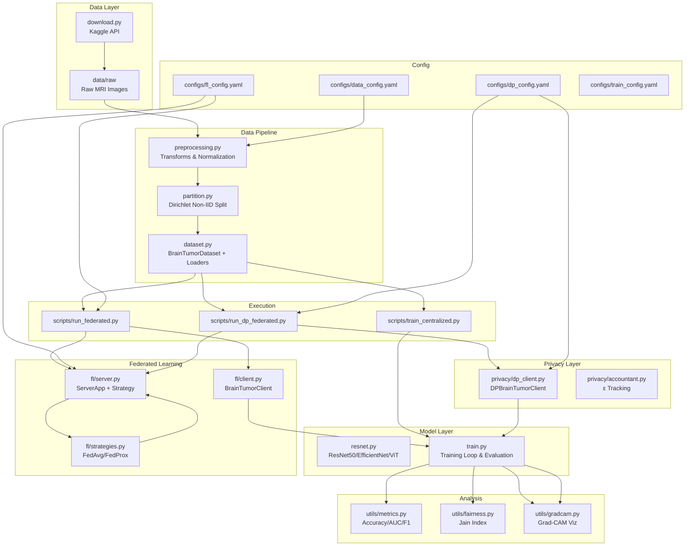

# FedTumorNet Architecture Documentation

## Overview

**FedTumorNet** is a privacy-preserving federated learning system for brain tumor classification across multiple hospitals. The system implements federated averaging (FedAvg/FedProx) with differential privacy (DP-SGD via Opacus) and supports multiple model architectures (ResNet-50, EfficientNet-B0, ViT-Small).

**Tech Stack**: Flower (flwr) | PyTorch | Opacus | NumPy

---

## Functional Areas

### 1. Data Pipeline (`src/data/`)

 Responsible for dataset management, preprocessing, and federated data partitioning.

| Module | Responsibility |
|--------|---------------|
| `download.py` | Kaggle API dataset downloading |
| `preprocessing.py` | Image transforms (train/eval), normalization |
| `partition.py` | Dirichlet non-IID partitioning with visualization |
| `dataset.py` | `BrainTumorDataset` class, centralized/FL dataloaders |

**Key Classes:**
- `BrainTumorDataset` - wraps image paths + labels with transforms
- `create_federated_datasets()` - creates per-client train/val/test splits
- `get_dataloaders()` - produces DataLoaders for each client

### 2. Models (`src/models/`)

 Model architectures and training loops.

| Module | Responsibility |
|--------|---------------|
| `resnet.py` | ResNet-50, EfficientNet-B0, ViT-Small factory (`get_model()`) |
| `train.py` | Centralized training loop, evaluation, early stopping |

**Key Functions:**
- `get_model()` - model factory based on config
- `train_one_epoch()` - single epoch training
- `evaluate()` - returns loss, accuracy, predictions, labels, probabilities
- `train_centralized()` - full training pipeline with checkpointing

### 3. Federated Learning (`src/fl/`)

 Flower-based distributed learning infrastructure.

| Module | Responsibility |
|--------|---------------|
| `client.py` | `BrainTumorClient` - local training, weight serialization |
| `server.py` | `ServerApp` factory, strategy configuration, global evaluation |
| `strategies.py` | FedAvg, FedProx strategy wrappers |
| `utils.py` | Weight get/set utilities |

**Key Classes:**
- `BrainTumorClient` - wraps model, data loaders, trains locally, returns updates
- `DPBrainTumorClient` (in `privacy/`) - extends BrainTumorClient with Opacus DP

**Key Functions:**
- `create_server_app()` - builds Flower ServerApp with config
- `get_strategy()` - returns configured aggregation strategy
- `server_fn()` - Flower runtime callback for ServerAppComponents

### 4. Privacy (`src/privacy/`)

 Differential privacy implementation using Opacus.

| Module | Responsibility |
|--------|---------------|
| `dp_client.py` | `DPBrainTumorClient` with DP-SGD, privacy budget tracking |
| `accountant.py` | Privacy budget accounting (RDP) |
| `utils.py` | DP-related utilities |

**Key Class:**
- `DPBrainTumorClient` - extends BrainTumorClient with:
  - Per-sample gradient clipping via Opacus PrivacyEngine
  - Gaussian noise addition
  - Privacy budget tracking (`epsilon_spent`)

**Key Function:**
- `compute_noise_multiplier()` - calculates noise for target (ε, δ)

### 5. Utils (`src/utils/`)

 Evaluation metrics, fairness analysis, and explainability.

| Module | Responsibility |
|--------|---------------|
| `metrics.py` | Accuracy, AUC-ROC, F1, confusion matrix, classification report |
| `fairness.py` | Jain fairness index, fairness gap computation |
| `gradcam.py` | Grad-CAM visualization for model interpretability |
| `experiment.py` | Experiment tracking and result management |

---

## Key Execution Flows

### Flow 1: Federated Training Pipeline

```
┌─────────────────────────────────────────────────────────────────┐
│                     Federated Learning Flow                      │
├─────────────────────────────────────────────────────────────────┤
│                                                                  │
│   [ServerApp]                                                   │
│       │                                                         │
│       ▼                                                         │
│   Initialize Strategy (FedAvg/FedProx)                         │
│       │                                                         │
│       ▼                                                         │
│   For each round (1..N):                                        │
│       │                                                         │
│       ├──► Select clients (fraction_fit)                       │
│       │                                                         │
│       ├──► Broadcast global weights ──────────────────────────┐ │
│       │                                                         │ │
│       │    [ClientApp]                                        │ │
│       │         │                                              │ │
│       │         ▼                                              │ │
│       │    Set global weights                                  │ │
│       │         │                                              │ │
│       │         ▼                                              │ │
│       │    Local training (3 epochs) ─────────────────────┐   │ │
│       │         │                                       │   │ │
│       │         ▼                                       │   │ │
│       │    Return updated weights + metrics             │   │ │
│       │                                                         │ │
│       ◄──────────────────────────────────────────────────┘   │
│       │                                                         │
│       ▼                                                         │
│   Aggregate weights (weighted average)                         │
│       │                                                         │
│       ▼                                                         │
│   Global evaluation on test set                                 │
│       │                                                         │
│       ▼                                                         │
│   Save checkpoint (if best)                                     │
│                                                                  │
└─────────────────────────────────────────────────────────────────┘
```

### Flow 2: Differential Privacy FL Pipeline

```
┌─────────────────────────────────────────────────────────────────┐
│                    DP Federated Learning Flow                   │
├─────────────────────────────────────────────────────────────────┤
│                                                                  │
│   [ServerApp] ─ same as above ─                                  │
│       │                                                         │
│       ▼                                                         │
│   Initialize Strategy + evaluate_fn                             │
│       │                                                         │
│       ▼                                                         │
│   For each round:                                               │
│       │                                                         │
│       ├──► Client selection                                     │
│       │                                                         │
│       ├──► Broadcast weights                                    │
│       │                                                         │
│       │    [DPClient]                                           │
│       │         │                                                │
│       │         ▼                                                │
│       │    Initialize Opacus PrivacyEngine                      │
│       │         │                                                │
│       │         ▼                                                │
│       │    For each batch:                                      │
│       │         ├── Compute gradients                           │
│       │         ├── Clip per-sample gradients (max_grad_norm)   │
│       │         ├── Add Gaussian noise                          │
│       │         └── Step optimizer                               │
│       │         │                                               │
│       │         ▼                                               │
│       │    Track epsilon spent                                  │
│       │         │                                               │
│       │         ▼                                               │
│       │    Return weights + DP metrics                           │
│       │                                                         │
│       ◄──────────────────────────────────────────────────────┘   │
│       │                                                         │
│       ▼                                                         │
│   Aggregate + Evaluate (same as above)                          │
│                                                                  │
└─────────────────────────────────────────────────────────────────┘
```

### Flow 3: Centralized Baseline Training

```
┌─────────────────────────────────────────────────────────────────┐
│                  Centralized Training Flow                       │
├─────────────────────────────────────────────────────────────────┤
│                                                                  │
│   Load config + set random seed                                 │
│       │                                                         │
│       ▼                                                         │
│   Create centralized dataloaders (train/val/test)              │
│       │                                                         │
│       ▼                                                         │
│   Initialize model (ResNet-50) + optimizer + scheduler         │
│       │                                                         │
│       ▼                                                         │
│   For each epoch (1..max_epochs):                               │
│       │                                                         │
│       ├── train_one_epoch()                                     │
│       │     │                                                   │
│       │     └── forward → loss → backward → step               │
│       │                                                         │
│       ├── evaluate() on validation set                          │
│       │     │                                                   │
│       │     └── forward → compute metrics                       │
│       │                                                         │
│       ├── scheduler.step()                                      │
│       │                                                         │
│       └── if val_loss improved: save best checkpoint            │
│                                                                  │
│   Restore best model → evaluate on test set                      │
│       │                                                         │
│       ▼                                                         │
│   Compute: AUC-ROC, F1, confusion matrix, classification report  │
│       │                                                         │
│       ▼                                                         │
│   Save: figures, training curves, metrics JSON                   │
│                                                                  │
└─────────────────────────────────────────────────────────────────┘
```

### Flow 4: Data Partitioning Flow

```
┌─────────────────────────────────────────────────────────────────┐
│                   Non-IID Data Partitioning                      │
├─────────────────────────────────────────────────────────────────┤
│                                                                  │
│   Load all image paths + labels (dir structure: /class/*.jpg)   │
│       │                                                         │
│       ▼                                                         │
│   dirichlet_partition()                                         │
│       │                                                         │
│       ├── Sample from Dirichlet(α) per class                   │
│       │                                                         │
│       ├── Assign each sample to a client based on α draw        │
│       │                                                         │
│       └── Returns: List[List[int]] - indices per client         │
│                                                                  │
│   For each client:                                               │
│       │                                                         │
│       ├── Split client data → train (70%) / val (15%) / test   │
│       │                                                         │
│       └── Create BrainTumorDataset with appropriate transform  │
│                                                                  │
│   Create global test set (from held-out Testing folder)         │
│       │                                                         │
│       ▼                                                         │
│   visualize_partition() → save α visualization                 │
│                                                                  │
└─────────────────────────────────────────────────────────────────┘
```

---

## Mermaid Architecture Diagram



---

## Directory Structure

```
Medical/
├── configs/
│   ├── data_config.yaml          # Dataset paths, image size
│   ├── train_config.yaml         # Centralized training hyperparams
│   ├── fl_config.yaml            # FL num_clients, rounds, strategy
│   ├── dp_config.yaml            # ε, δ, max_grad_norm
│   └── ablation_config.yaml      # Ablation study parameters
├── src/
│   ├── data/
│   │   ├── download.py           # Kaggle dataset download
│   │   ├── preprocessing.py     # Image transforms
│   │   ├── partition.py          # Dirichlet partitioning
│   │   └── dataset.py            # Dataset class + dataloaders
│   ├── models/
│   │   ├── resnet.py             # Model factory
│   │   └── train.py              # Training loop
│   ├── fl/
│   │   ├── client.py             # Flower ClientApp
│   │   ├── server.py             # Flower ServerApp
│   │   ├── strategies.py         # Aggregation strategies
│   │   └── utils.py              # Weight serialization
│   ├── privacy/
│   │   ├── dp_client.py          # Opacus DP client
│   │   ├── accountant.py         # Privacy accounting
│   │   └── utils.py              # DP utilities
│   └── utils/
│       ├── metrics.py            # Evaluation metrics
│       ├── fairness.py           # Fairness analysis
│       ├── gradcam.py            # Explainability
│       └── experiment.py         # Experiment tracking
├── scripts/
│   ├── train_centralized.py     # Centralized baseline runner
│   ├── run_federated.py          # FL simulation runner
│   └── run_dp_federated.py       # DP-FL simulation runner
├── outputs/
│   ├── checkpoints/             # Model checkpoints
│   ├── figures/                 # Visualizations
│   └── fl_experiments/          # FL experiment results
└── paper/                       # LaTeX manuscript
```

---

## Configuration Hierarchy

| Config | Purpose | Key Fields |
|--------|---------|------------|
| `data_config.yaml` | Dataset paths, image processing | `data_dir`, `image_size`, `class_names` |
| `train_config.yaml` | Centralized training | `num_epochs`, `learning_rate`, `batch_size`, `early_stopping_patience` |
| `fl_config.yaml` | Federated learning | `num_clients`, `num_rounds`, `strategy.name`, `dirichlet_alpha` |
| `dp_config.yaml` | Differential privacy | `epsilon_values[]`, `delta`, `max_grad_norm` |

---

## Key Dependencies

| Package | Purpose |
|---------|---------|
| `flwr` (Flower) | Federated learning framework |
| `opacus` | Differential privacy training |
| `torch` | Deep learning backend |
| `torchvision` | ResNet, transforms |
| `tensorflow` (via `tf-keras`) | EfficientNet support |
| `timm` | ViT models |
| `scikit-learn` | Metrics, train_test_split |
| `numpy` / `pandas` | Numerical operations |
| `pyyaml` | Config loading |